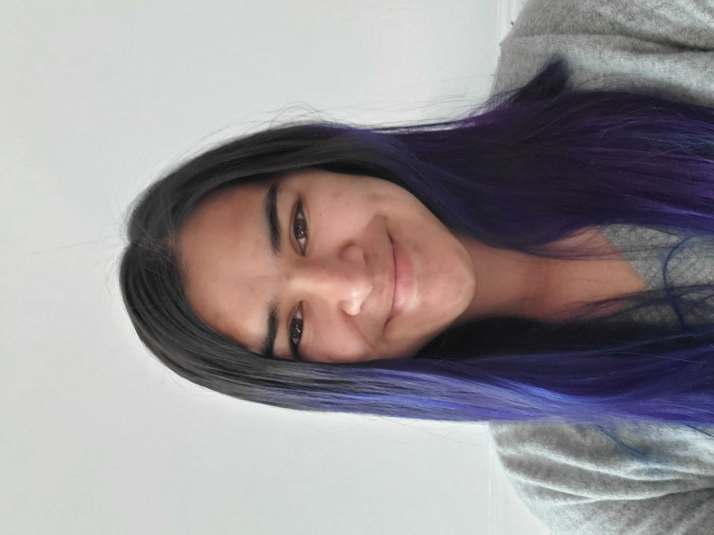

## A Little Bit About Me

My name is Asya Balas (*pronounced Asia Bay-less*). I am currently a Second Year Computer Science major at Univeristy of California, San Diego, with plans to minor in Chinese Studies and Economics. I am currently very interested in Linguistics and am interested in exploring how to apply my CS learnings to that field.

This is me!

#

[Who I am as a programmer](#programming)

# 

My favorite quote right now comes from my LIGN 101 professor, Will Styler:
> **I'm broken in a very creative way**

This quote leads to the idea that being broken isn't a bad thing, like people tend to assume. Instead, creativity has changed the way you experience life - it has opened many new paths for you to explore and interpret what you see.

#

In my free time I like to pick up hobbies. Though I may pick up a lot at once, I stick with a few and become very invested in learning all I can. I may also put down a hobby and then come back to after a while. I have to find my groove and determine when I can best perform. Those hobbies include:
- knitting 
- crochet
- reading
- baking
- curating the 'best' Spotify playlists (kpop, ajr, the lumineers are some of my favs)
- kdrama and anime binges
- contemplating how I can learn more languages and which languages I want to learn
- falling down the YouTube rabbit hole
- doing nothing 
- playing with my dogs, [Sashi](20170704_192436%20(1).jpg) and [Zeus](20210304_162713.jpg)

# 

## Programming 

### Experience 
I have participated in two Hackathons, with one win and lots of experience gained.
1. LA Hackademia in 2018, a Hackathon hosted at UCLA solely for high school students. My team's project was like a LinkedIn/Yelp hybridization called Peer2Peer. The idea behind it was to provide students applying to colleges with another resource so they would have peer feedback, not just teacher recommendation to help them.
2. [Athena Hacks](https://athenahacks.com/) in 2021, virtually. My team and I created *Advice*, a website that was a toolkit to helping you out with life's struggles. At this hackathon I was able to learn about `HTML` and `CSS` a little bit, and am now intrigued to learn more.

### Takeaways

I think almost everything in life, especially any programming tasks, should be handled in the way that git handles adding changed to a repository. And by that I mean following the commands in the checklist below:
- [ ] `git add`
- [ ] `git commit`
- [ ] `git push`

This forces you to take the time to *slow down*, evaluate what you have done and what you need to do, make conscious and informed decisions, all **before** you finalize anything. Programming has taught me a valuable life skill to apply to a broad scope in life.
 # 
When programming, I also like to write down my thoughts on paper before going straight to coding a project because it allows me to reorganize my thoughts and to visualize them in front of me. This method of programming also forces my to really think through my logic and create my own test cases instead of relying on a computer to find the bugs for me.

# 

[Who I Am as a Person](#a-little-bit-about-me)

